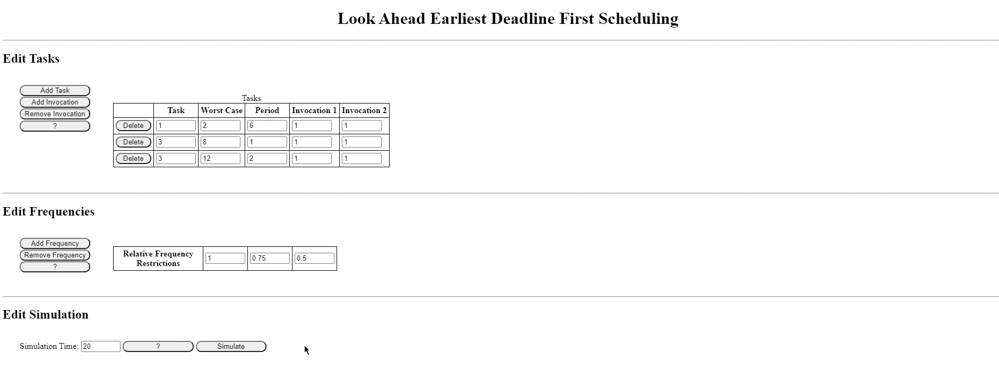
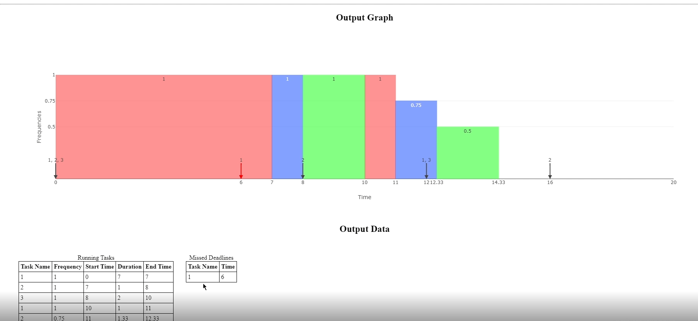

# Look-Ahead EDF (Earliest Deadline First) Algorithm Simulator

## Description

This program is used to simulate the optimal dynamic priority scheduling algorithm used in real-time systems, Earliest Deadline First. This algorithm is used in operating systems for scheduling tasks as well as processes with specific deadlines.

This algorithm simulator was created in a team enviornment, to demonstrate how the algorithm can assign highest priority to the tasks with the earliest deadline. HTML/CSS is used for the frontend, with Javascript in the backend. Electron Fiddle was used to compile and package the project.

